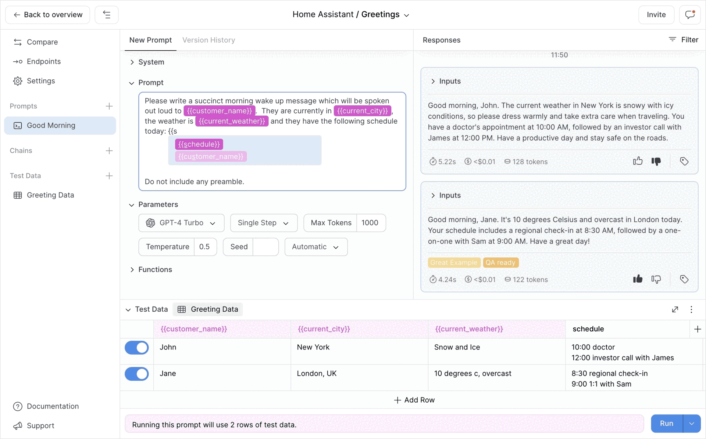

# PlayFetch

PlayFetch makes adding Large Language Model features to your app quick and painless.

## Background

LLMs have changed the way product teams are working.  Increasingly large parts of applications are now being built with natural language.  There are often non-engineering team members involved in this process — content strategists who care about the tone and delivery of the generated text, domain experts who are bringing highly specialised knowledge to generated content, and designers & product managers who have a deep understanding of their product needs.  With these new team members involved in prototyping, developing and maintaining critical parts of applications along side the engineering team there are lots of new interactions.

These new interactions between engineers and the rest of the team need new tooling. Engineers don’t want plain text distributed throughout their code bases with constant requests for updates only to find the new version isn’t actually better.  Contributors to prompts or chains don’t want to have to wait for an engineer to integrate their updates before finding that they don’t perform as expected. PlayFetch solves these and many other pain points we’ve observed in companies working this way.

## What is PlayFetch?

- An intuitive prompt playground built around collaboration with comments, annotations, labels, and ratings.
- A non-destructive versioning system that any team member can use transparently.
- A testing environment with data import and export, measurement chains, and automated chat bot testing.
- An LLM platform that seamlessly integrates with tools for source control, project management and vector stores.
- A model-agnostic hosting solution with a simple unified API supporting simple calls, chat, and manual interrupts.
- An analytics and monitoring solution focused around LLM feature needs.

## Deploying PlayFetch on Google Cloud

PlayFetch has been optimised to run on Google Cloud Platform. Follow the instructions below to get your own instance up and running. We will assume you have forked the official PlayFetch repository at [https://github.com/yello-xyz/playfetch](https://github.com/yello-xyz/playfetch) (so you can set up continuous integration). If you plan to make code changes, you can run through these instructions multiple times to set up separate instances for development, staging, and production.

### Configure a new project

- Set up your Google Cloud Platform account on [https://cloud.google.com/](https://cloud.google.com/?hl=en).
- Access the Cloud Console at [https://console.cloud.google.com](https://console.cloud.google.com/).
- Navigate to **IAM & Admin** → **Manage Resources** and click **CREATE PROJECT**.
- Pick a unique name (cannot be changed later) and click **CREATE**.
- Navigate to **Billing**, and under **Account management**, ensure billing is enabled for the new project.

### Configure APIs

- Navigate to **APIs & Services** → **Enabled APIs & Services**.
- Ensure the newly created project is selected in the project selector at the top.
- Click **ENABLE APIS AND SERVICES**.
- Search for **App Engine Admin API** and click **ENABLE**.
- Search for **Cloud Build API** and click **ENABLE**.
- Search for **Cloud Datastore API** and click **ENABLE**.
- Search for **Cloud Scheduler API** and click **ENABLE**.
- Search for **Google App Engine Flexible Environment** and click **ENABLE**.
- Search for **Identity and Access Management (IAM) API** and click **ENABLE**.
- Search for **Vertex AI API** and click **ENABLE**.

### Configure the App Engine application

- Navigate to **App Engine** → **Dashboard** and click **CREATE APPLICATION**.
- Pick a location (cannot be changed later).
- Leave the service account option open (we’ll use the default) and click **NEXT**.
- Ignore the deployment panel (click **I’LL DO THIS LATER**).

### Configure the datastore

- Navigate to **Datastore**.
- If you don’t see the **(default)** datastore, wait a minute and refresh.
- Select the **(default)** datastore.
- Select **Time-to-live (TTL)** in the sidebar and click **CREATE POLICY**.
- Set **Kind** to **_nextauth_token** and **Timestamp property** to **expires** and click **CREATE**.
- Create another policy with kind **cache** and property **expiresAt**.

### Configure the storage bucket

- Navigate to **Cloud Storage** → **Buckets** and select bucket ***[project-name]*.appspot.com**.
- Under **PERMISSIONS**, click **GRANT ACCESS**.
- Add principal **allUsers** and assign role **Storage Object Viewer**.
- Click **SAVE** and **ALLOW PUBLIC ACCESS** (this bucket will be used for storing avatars).

### Configure the build service account

- Navigate to **IAM & Admin** → **Service accounts** and click **CREATE SERVICE ACCOUNT**.
- Pick a unique name and click **CREATE AND CONTINUE**.
- Select role **Service Account User**.
- Click **ADD ANOTHER ROLE** and select **App Engine Deployer**.
- Click **ADD ANOTHER ROLE** and select **App Engine flexible environment Service Agent**.
- Click **ADD ANOTHER ROLE** and select **App Engine Service Admin**.
- Click **ADD ANOTHER ROLE** and select **Cloud Build Service Account**.
- Click **ADD ANOTHER ROLE** and select **Cloud Datastore Index Admin**.
- Click **ADD ANOTHER ROLE** and select **Cloud Scheduler Admin**.
- Click **CONTINUE** and **DONE**.

### *[optional]* Configure a custom domain

- Navigate to **App Engine** → **Settings**.
- Under **CUSTOM DOMAINS,** click **ADD A CUSTOM DOMAIN**.
- Enter the custom domain and subdomains you want to use (following the instructions to verify ownership).
- Click **CONTINUE** and **DONE**.
- Add the records shown to the DNS configuration of your custom domain provider.

### *[optional but recommended]* Configure Google OAuth user authentication

- Navigate to **APIs & Services** → **OAuth consent screen**.
- Choose either **Internal** or **External** user type depending on your use case and click **CREATE**.
- Fill in the required fields, click **SAVE AND CONTINUE**, then click **ADD OR REMOVE SCOPES**.
- Check scope **.../auth/userinfo.profile** and **.../auth/userinfo.email**, then click **UPDATE** and **SAVE AND CONTINUE**.
- If you picked **External** user type above, you can add some test accounts (before publishing the app to production). Make sure to include the email address you want to use for your first admin user. Note that you will still need to grant these users access in PlayFetch as well.
- Click **SAVE AND CONTINUE** and **BACK TO DASHBOARD**.
- Select **Credentials** in the sidebar, then click **CREATE CREDENTIALS** and **OAuth client ID**.
- Select **Web application** as **Application type** and pick a name.
- Under **Authorized JavaScript origins**, add **https://*[project-name]*.appspot.com** (and custom domain if you have one). If you also want to to use Google Authentication when running the app locally, add **http://localhost:3000** as well.
- Under **Authorized redirect URIs**, add **https://*[project-name]*.appspot.com/api/auth/callback/google** (and a similar URL for any custom domain). If you also want to use Google Authentication when running the app locally, add **http://localhost:3000/api/auth/callback/google** as well.
- Click **CREATE** and copy the generated Client ID and Client secret to use in the build trigger setup below.

### Configure the build

- Navigate to **Cloud Build** → **Triggers** and click **CONNECT REPOSITORY**.
- Select source **GitHub (Cloud Build GitHub App)** and click **CONTINUE** to authenticate the GitHub account where you forked the repository (in a popup window).
- Select the forked repository, check the box underneath, and click **CONNECT**.
- Click **CREATE A TRIGGER**.
- Pick a name for your build.
- Under **Configuration**, select **Cloud Build configuration file (yaml or json)**.
- For a minimum setup, you will need to add the following **Substitution variables** to your build trigger (in the **Advanced** section) by clicking **ADD VARIABLE**:
    - **_ENCRYPTION_KEY**: random string of 64 *hexadecimal* digits.
    - **_NEXTAUTH_SECRET**: random string of at least 32 characters.
    - **_NEXTAUTH_URL**: public facing URL for your instance, either a custom domain if you have one or otherwise **https://*[project-name]*.appspot.com**.
    - **_GCLOUD_STORAGE_BUCKET**: the name of the Cloud Storage bucket where you allowed public access e.g. ***[project-name]*.appspot.com**.
    - **_NOREPLY_EMAIL_USER** and **_NOREPLY_EMAIL_PASSWORD**: Gmail account to be used for outgoing transactional emails. Can be a dedicated account in your Google Workspace (with regular password), or a separate Gmail account (with app password). See instructions below if you need to use another email provider.
- If you configured Google authentication above, you should also add the following variables:
    - **_GOOGLE_CLIENT_ID** and **_GOOGLE_CLIENT_SECRET**: the values you copied above after generating OAuth credentials.
- Under **Service account**, select the service account you created above.
- Click **CREATE**.
- Click **RUN** next to your newly created trigger and then click **RUN TRIGGER.**
- Select **History** in the sidebar, and wait to verify your build completes successfully (can take 10-15 minutes).

### Initialise your PlayFetch environment

- Pick an email address that will be used as login for the initial admin user.
- Open a browser and navigate to **https://*[project-name]*.appspot.com/api/admin/init?admin=*[user@domain.com]*** (make sure to specify the correct email address in the query).
- This endpoint will run a script to initialise the datastore (which may take a minute) but you will only be able to run it once (unless you recreate the datastore).
- Once the script completes, copy the values for **_PLAYFETCH_API_KEY** and **_PLAYFETCH_ENDPOINT_URL** that are shown in the response.
- Navigate to **Cloud Build** → **Triggers**, click the trigger you created, add the two additional **Substitution variables** from the step above, and click **SAVE**.
- Run your build trigger again with the added variables. This build may need to generate missing datastore indexes, so it is best to wait until it completes again.

You should now be able to navigate to **https://*[project-name]*.appspot.com** and log in with the email address you specified for your first admin user. You can use either Google authentication (if configured) or Email links (provided the **_NOREPLY_EMAIL** variables are set up correctly). Additional users can be granted access in the Admin panel.

## Running PlayFetch locally

If you want to contribute to PlayFetch or debug issues, you can follow the instructions below to get it running on your local machine.

### Install node and npm

The easiest way to install the latest version of **node** and **npm** is to run the [latest installer](https://nodejs.org/en/download).

### Clone the repository

Either **Open with GitHub Desktop** and clone to a local directory or [Connect to GitHub with SSH](https://docs.github.com/en/authentication/connecting-to-github-with-ssh) and run `git clone git@github.com:yello-xyz/playfetch.git`. If you already forked the repository, you can clone that one instead.

### Configure environment

In order to run the app locally, you will need to add some same variables to your local **.env.local** file (this file is ignored by source control to avoid leaking keys). These can be the same values as the ones you specified in your Google Cloud build trigger for your development instance (assuming you are running a separate instance for production as you don’t want to risk leaking those keys), except for **_NEXTAUTH_URL** where should specify the value **http://localhost:3000.**

You can access the datastore in Google Cloud from your local machine (again assuming you are running a separate development instance so you don’t accidentally corrupt or leak production data) by installing the Google Cloud CLI and initialising it as explained [here](https://cloud.google.com/sdk/docs/install-sdk) (you can skip the other steps). Run the following commands to log in with your Google account:

- `gcloud auth login`
- `gcloud init`
- `gcloud auth application-default login`
- `gcloud init`

### Build and run

You should now be able to run the following commands:

- `npm install`
- `npm run build`
- `npm run start`

Alternatively, during development, you can just run the following command to run a debug build with fast refresh:

`npm run dev`

To run all tests once:

`npm run test` 

To watch for changes and automatically re-run the relevant test suites:

`npm run watch` 

## Optional features

In order to extend the minimum setup, you can configure the following environment variables (either in your GCP build trigger or in your local .env.local file) to enable some additional features.

### Integrations

- **_GITHUB_CLIENT_ID**, **_GITHUB_CLIENT_SECRET**: can be used to configure GitHub OAuth authentication (similar to Google). Requires setting up a GitHub OAuth app.
- **_GITHUB_APP_CLIENT_ID**, **_GITHUB_APP_CLIENT_SECRET**, **_GITHUB_APP_ID**, **_GITHUB_APP_PRIVATE_KEY**, **_NEXT_PUBLIC_GITHUB_APP_INSTALL_LINK**: can be used to configure source control integration. Requires setting up a GitHub app.
- **_LINEAR_APP_CLIENT_ID**, **_LINEAR_APP_CLIENT_SECRET**, **_LINEAR_APP_WEBHOOK_SECRET**: can be used to configure task management integration. Requires setting up a Linear app.
- **_NOTION_TOKEN, _NOTION_ONBOARDING_PAGE_ID, _NOTION_WAITLIST_PAGE_ID**: can be used to automatically synchronise waitlist signups and onboarding survey responses to Notion. Requires setting up a Notion app.

### Analytics

- **_GOOGLE_ANALYTICS_API_SECRET**, **_GOOGLE_ANALYTICS_MEASUREMENT_ID**: can be used to configure server side analytics (GA4).
- **_NEXT_PUBLIC_GOOGLE_TAG_MANAGER_ID**, **_NEXT_PUBLIC_COOKIE_DOMAIN**, **_NEXT_PUBLIC_COOKIE_NAME**: can be used to configure cookies and client side analytics (Google Tag Manager).

### Environment

- **_NEXT_PUBLIC_DOCS_URL**, **_NEXT_PUBLIC_SUPPORT_EMAIL**: can be used to generate the links to Documentation and Support in the workspace and project sidebars.
- **_GOOGLE_ANALYTICS_DASHBOARD_URL**, **_GOOGLE_ANALYTICS_REPORTS_URL**, **_GOOGLE_SEARCH_CONSOLE_URL**, **_INTEGRATION_TEST_URL**, **_SERVER_LOGS_URL**: can be used to add various diagnostic links in the Admin panel.
- **_NOREPLY_EMAIL_HOST**, **_NOREPLY_EMAIL_PORT**: can be used to configure an alternative email provider for outgoing transactional emails.
- **_API_URL**: can be used to split traffic between website and api, e.g. if you have separate subdomains pointing to your instance.

## License

PlayFetch is open source under a permissive [MIT](./LICENSE) license.

Please note that PlayFetch uses [CodeMirror](https://codemirror.net) as a dependency. If you are using CodeMirror commercially, there is a social (but no legal) expectation that you [help fund its maintenance](https://marijnhaverbeke.nl/fund/).

## Contributing

PlayFetch is being developed on [GitHub](https://github.com/yello-xyz/playfetch). Contributions are welcome. Feel free to open issues or open pull requests when fixing bugs or adding features. To get you started, some inspiration can be found in [TODO.md](./TODO.md).
